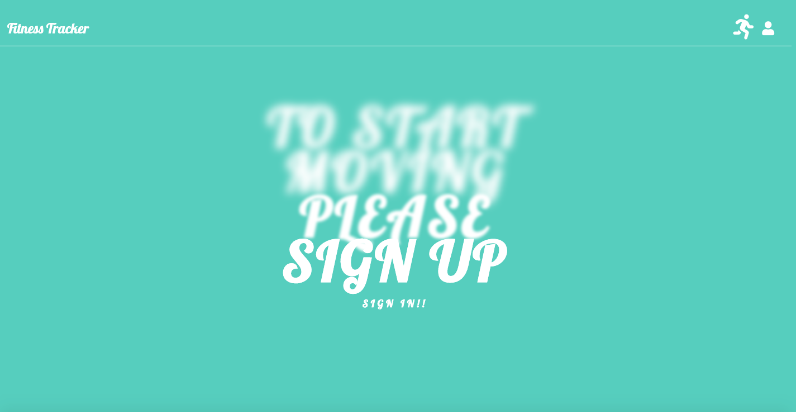
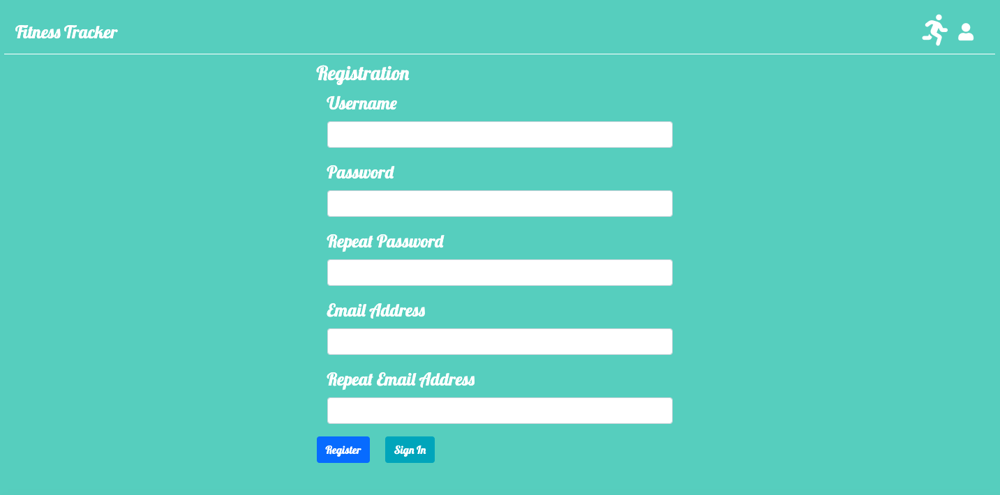
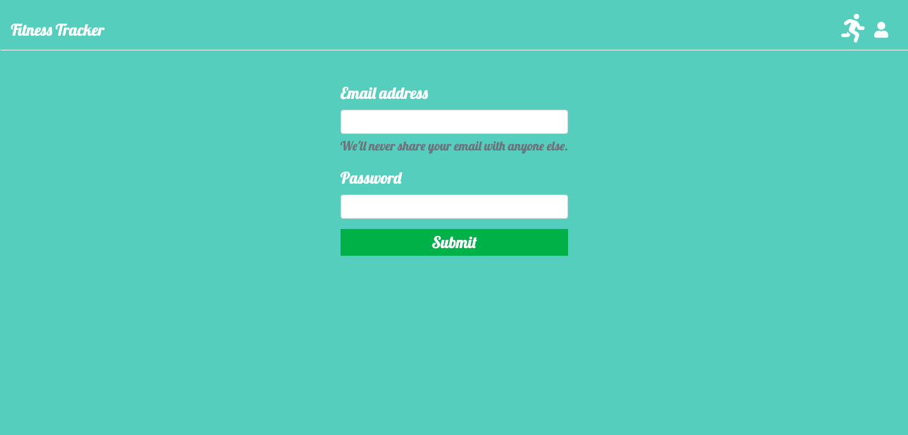
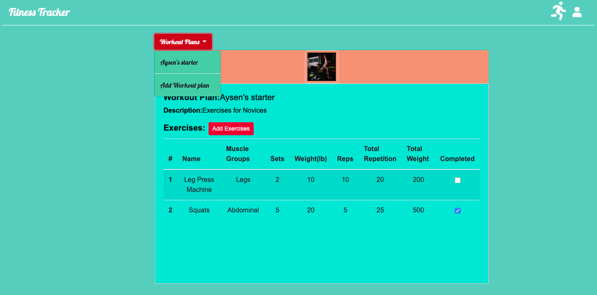
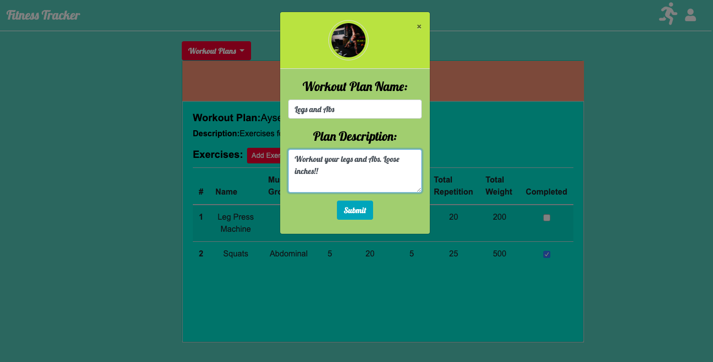
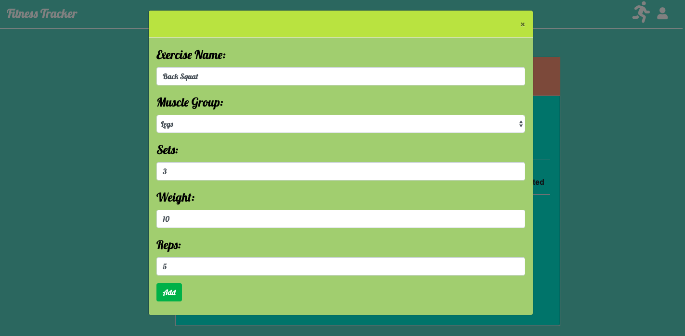
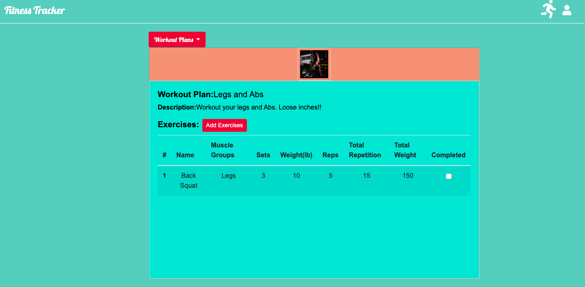

# FITNESS TRACKER(NoSQL)

## About: ##

* For this assignment, we created a workout tracker. This assignment requires us to create Mongo database with a Mongoose schema and handle routes with Express. When the user loads the page, they can create a new workout, or continue with their last workout or explore their previous workouts. They can add exercises to a previous workout plan or a new workout plan. They can mark the exercises completed after they finish them. User needs to signup or signin to use the program. 

## Installation: ##

  * The application is deployed using Heroku: 

  * Running aplication can be reached at 

  # Setup for Local Machine

1. Create database: Fitness_Tracker
2. Run application using npm start or nodemon start

## Dependencies: ##

    The application depends on the following packages:

   *  bcrypt-nodejs: A library to help to hash passwords.
   *  body-parser: Node.js body parsing middleware.
   *  cookie-parser: Parses HTTP request cookies
   *  express: Provides small, robust tooling for HTTP servers
   *  express-handlebars: A Handlebars view engine 
   *  express-session: Session middleware for Express
   *  method-override: Lets us use HTTP verbs such as PUT or DELETE in places where the client doesn't support it.
   *  mongoose: Mongoose is a MongoDB object modeling tool designed to work in an asynchronous environment. Mongoose supports both promises and callbacks.
   *  morgan: HTTP request logger middleware for node.js
   *  nodemon: It is a tool that helps develop node.js based applications by automatically restarting the node application when file changes in the directory are detected.
   *  passport: Passport is Express-compatible authentication middleware for Node.js.
   *  passport-local: Local username and password authentication strategy for Passport.
   

## Usage: ##

   - When the user visits ......., he's welcomed with a sign up and sign in page

     
     
   - When user does no have an account, he has to set up one

     
     
   - When user has an account he has to sign in 

     

  - If the sign in is successfull, he will be directed to his workout page which lists all his workouts in the drop down menu and shows details about his last workout

     
    
  - He can add workout plans from the dropdown menu

     

  - He can add multiple exercises to the new or previous workout plans. Exercise name, the muscle group it targets, how many pounds of weight is used, sets and reps are specified. And it's shown in the table which also scrolls of too many exercises are entered.

     

  - Along with other info about exercises, total reps and weights, if it's completed or not are also listed.

     

  - User can click running man icon on the navigation menu to sign out and man figure to sign in or signup.
    

## Credits: ## 

I'm greatful for our instructor Omar Patel and TA's Tyler Bray, Matthew Calimbas for their help on the issues encountered in the process of developing this application.

The web sites that I found useful while implementing the application are listed below:

  * https://getbootstrap.com/docs/4.4/components/alerts/
  * https://bootsnipp.com/snippets/qrQp0
  * https://medium.com/@nicknauert/mongooses-model-populate-b844ae6d1ee7
  * https://docs.w3cub.com/mongoose
  * https://www.gymwolf.com/exercises/workout_plans/4812
  * https://github.com/OSP123/TravelSecure-Mongo
  * https://docs.mongodb.com/manual/reference/method/db.collection.findOneAndUpdate/
  
## Licence: ##

Anybody is welcomed to copy code snippets and test it out.
